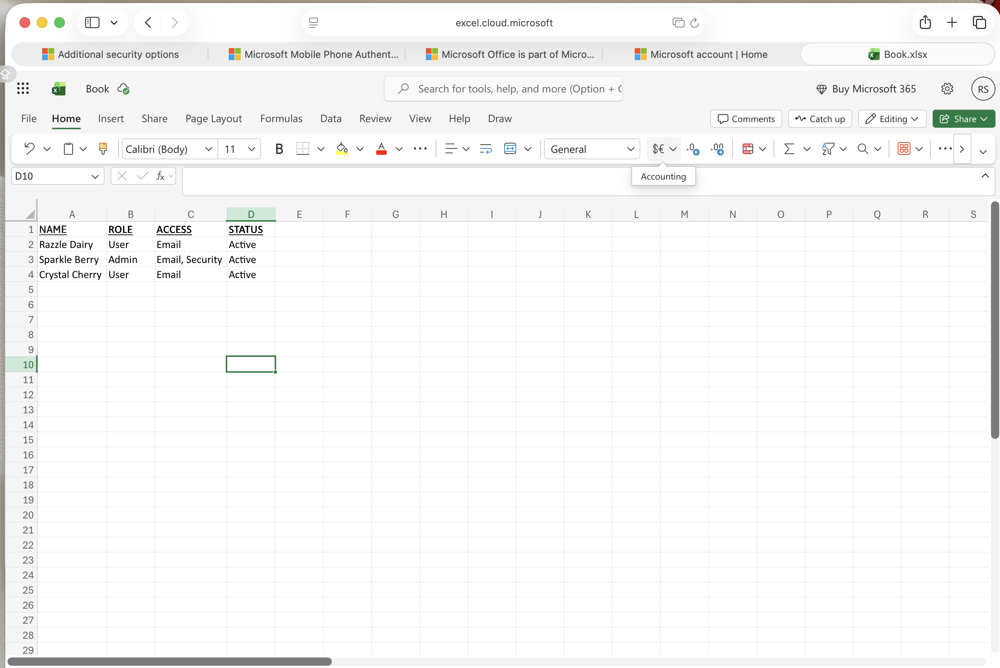
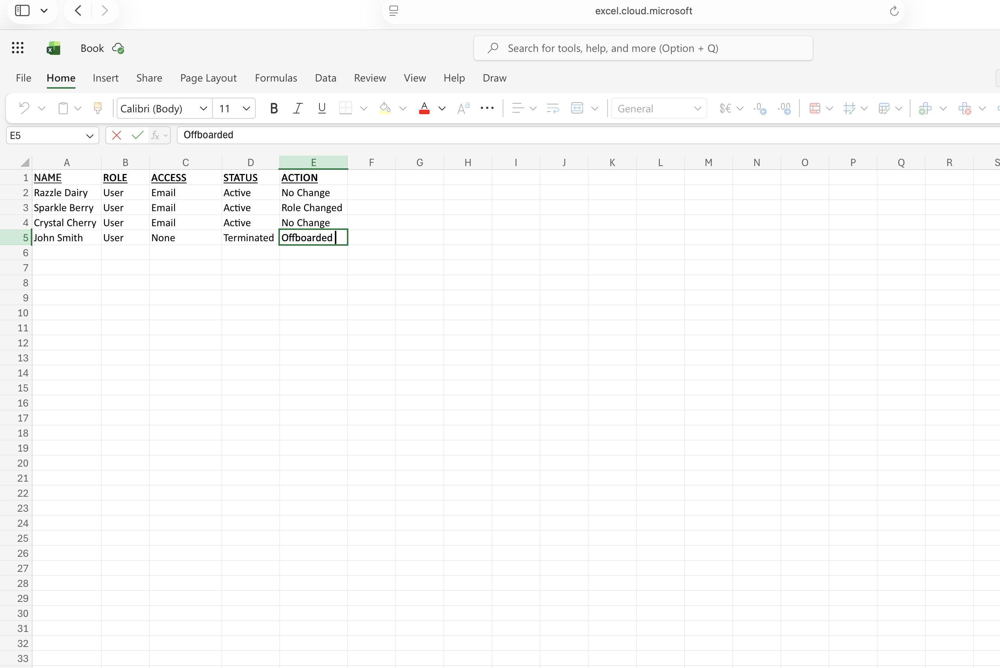

# User Lifecycle Management & RBAC Project

## Objective
Simulate a Joiner-Mover-Leaver (JML) process to manage user access based on roles.

## Tools Used
- Microsoft Excel (user tracking)
- Microsoft Account Security Settings
- Manual RBAC simulation

## Actions Taken
- Created user access table (Name, Role, Access, Status)
- Assigned role-based permissions
- Simulated onboarding (new user access)
- Simulated offboarding (removing access)
- Reviewed and updated access controls
## Evidence

### Before (Initial Access State)

### After (RBAC + Lifecycle Implemented)

## Findings
- Users initially had inconsistent access assignments
- No structured lifecycle process was in place
- Potential risk of excessive permissions

## Remediation
- Implemented role-based access control (RBAC)
- Standardized onboarding and offboarding process
- Ensured MFA was enabled for all users

## Result
- Improved access control structure
- Reduced risk of unauthorized access
- Established a repeatable IAM process
